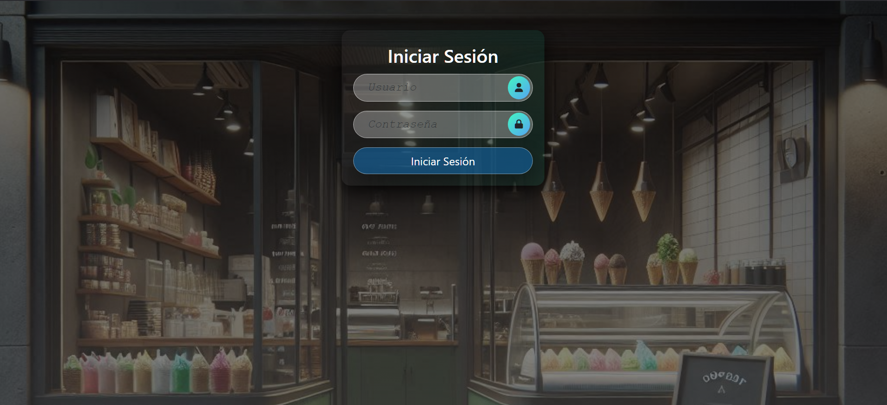
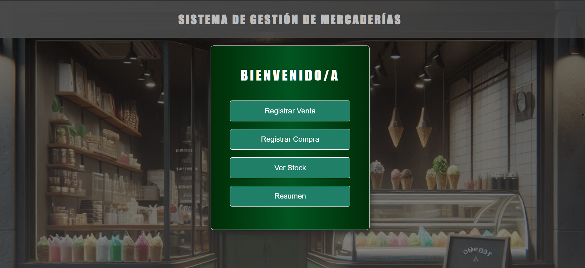
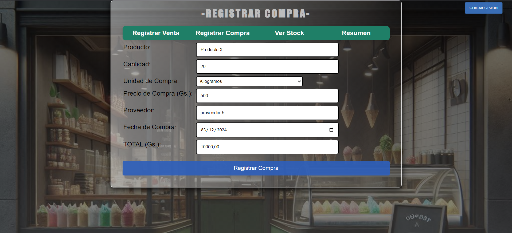
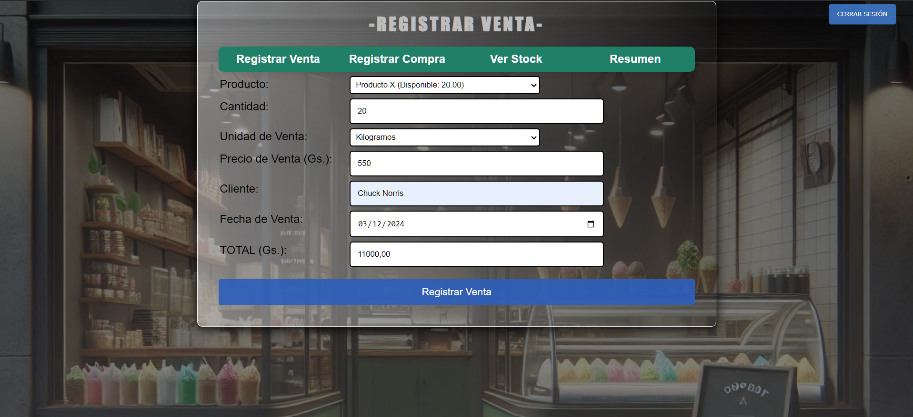
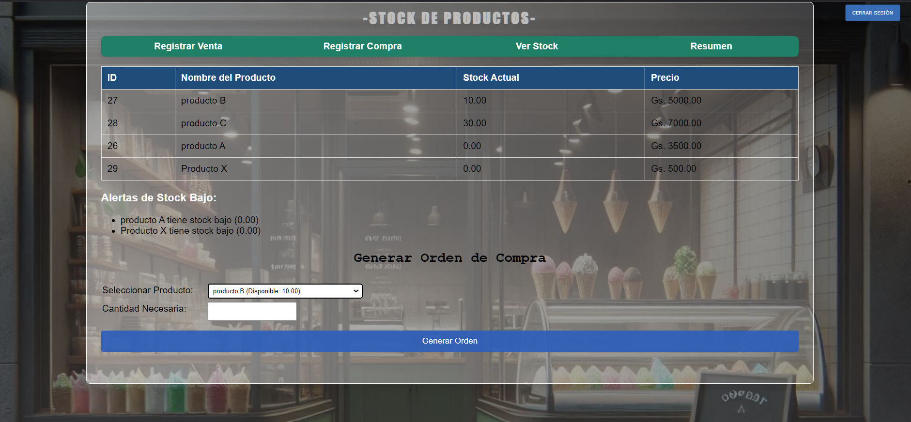
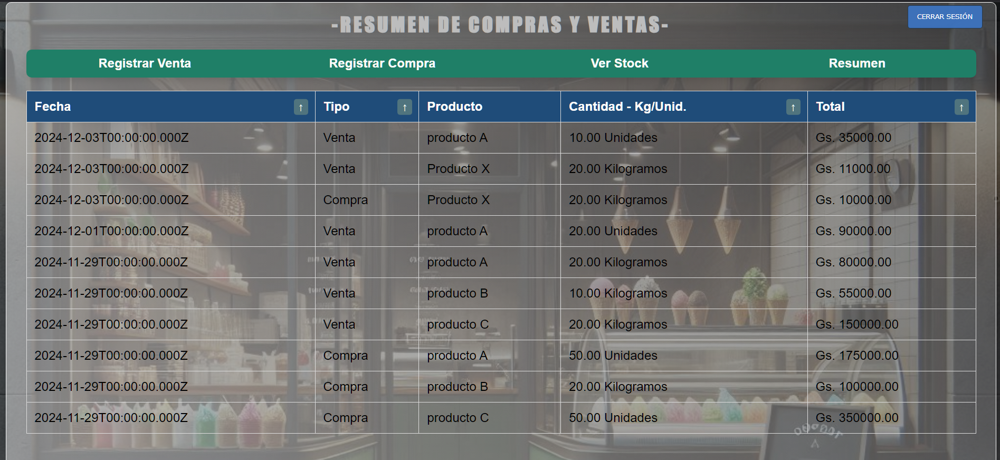

# Sistema de Gestión de Mercaderías

Este proyecto es un sistema de control de stock diseñado específicamente para una heladería. Lo he desarrollado completamente desde cero para ofrecer una solución personalizada, segura y eficiente, pero puede ser adaptado a cualquier tipo de negocio que requiera registrar productos, gestionar inventarios, emitir alertas, realizar ventas y compras, y generar reportes detallados. Todo el código fuente que estoy compartiendo aquí es la base que puede ser pulida pero es totalmente funcional. Ya queda a disposición de usted maestro Jedi pulirlo como le apetezca, claro está😊.
Esta aplicación web cumple con su propósito, que es ayudar a gesionar mercaderías de manera eficiente.

Aquí tiene una muestra del front-end del sistema: https://danicentg.github.io/OnlyFrontEnd-Sistema-de-gestion-de-productos/

La parte del back-end está integrada en el repo. Sigue leyendo más abajo para poder clonar y usarlo.

> [!NOTE]
>
> LUEGO DE LEER ESTA PARTE:
> 1. Este proyecto lo realicé para desplegarse de manera local. Si usted quiere desplegarlo en un entorno web o en producción recuerda que lo puede adaptar, pero debe aplicar las medidas de seguridad que son necesarias para un enterno más seguro.
> 2. PARA INGRESAR DATOS DEBE PRIMERAMENTE TENER REGISTRADO USUARIOS EN LA BASE DE DATOS (Te lo explico más abajo en el punto [6](#6-acceder-al-sistema-desde-tu-navegador) como hacer eso de dos maneras, usa cualquiera que te parezca mejor).

> PERO ANTES SIGUE LAS INSTRUCCIONES DE ABAJO: [Características Principales](#-características-principales) PARA PODER USARLO:

---

## 🚀 **Características Principales**
- **Seguridad y Autenticación**: Acceso controlado mediante sesiones y contraseñas cifradas.
- **MENÚ de Gestión de Inventario**: Desde un Menú principal Agrega, Actualiza, Monitorea productos con alertas de stock bajo, Ordena de menor a mayor el Resumen de Compras y Ventas.
- **Registro de Compras y Ventas**: Registro de transacciones con validación en tiempo real.
- **Generación de Órdenes de Compra**: Crea órdenes de compra en PDF para mantener un seguimiento claro (le puedes dar el formato que más te guste en el PDF que genera el sistema).
- **Reportes Detallados**: Resumen de transacciones (ventas y compras) ordenados cronológicamente.
- **Interfaz Adaptativa**: Compatible con dispositivos de diferentes tamaños.

---


## 🛠️ **Instalación y Configuración**

### **Requisitos Previos**
1. Node.js (versión LTS recomendada).
2. PostgreSQL configurado y en ejecución.
3. Un navegador web moderno.


### **Pasos para Instalar**

## 1. Clona este repositorio:

```bash
git https://github.com/daniCentG/sistema-de-gestion-de-productos.git

cd tu-proyecto (cambia el directorio y ponle el nombre que quieras al proyecto)
```

## 2. Instala las dependencias:

```bash
npm install
```

> [!TIP]
> Para seguridad y como buena práctica es aconsejable verificar las vulnerabilidades de las dependencias para poder indentificarlas.
> Copia esto en la consola una vez dentro en el directorio del proyecto:
>
> " npm audit fix ", sin las comillas.

## 3. Configura las variables de entorno:

* Copia el archivo .env-Ejemplo y renómbralo como .env
* Ajusta las credenciales de la base de datos y otras configuraciones en el archivo .env

## 4. Crea la base de datos y las tablas ejecutando las instrucciones SQL en el archivo compartido " TABLAS-Y-SENTENCIAS-SQL.md ", sin las comillas:

> [!TIP]
> Utiliza PostgreSQL para la base de datos.
>
>Inicia la BASE DE DATOS con las credenciales que configuraste previamente. Debe coinicidir con lo que haz puesto en el archivo ".env", sin las comillas.
>
## 5. Inicia el servidor: 

node server.js  ó   también: npm start

## 6. Acceder al sistema desde tu navegador:

> [!IMPORTANT]
> DEBES DAR DE ALTA A USUARIOS CON SU CONTRASEÑA EN LA BASE DE DATOS PREVIAMENTE PARA PODER INGRESAR CON EL PANEL DE LOGIN.
> LO PUEDES HACER DE 2 MANERAS:
>
>RECUERADA!.. CON LA BASE DE DATOS EN EJECUCIÓN!, entonces;

1. SI NO QUIERES DAR DE ALTA DIRECTAMENTE AL USUARIO CON SU CONTRASEÑA MANUALMENTE EN LA BASE DE DATOS LO PUEDES HACER EJECUTANDO UN script.js QUE HASHEA LA CONTRASEÑA. LO HE SUBIDO CON LOS DEMÁS ARCHIVOS, EL ARCHIVO SE LLAMA: " addUserEjemplo.js ", sin comillas. (Lo puedes editar y luego borrar si quieres o administarlo tu mismo para dar ALTA a los usuarios que podrán trabajar en el sistema).

```javascript

//addUser.js
const bcrypt = require('bcrypt');
const pool = require('./config/database'); // Importar conexión a la base de datos

async function agregarUsuario(usuario, contraseña) {
    try {
        const hashedPassword = await bcrypt.hash(contraseña, 10); // Hashear la contraseña
        const query = 'INSERT INTO usuarios (usuario, contraseña) VALUES ($1, $2)';
        await pool.query(query, [usuario, hashedPassword]);
        console.log('Usuario agregado correctamente');
    } catch (error) {
        console.error('Error al agregar usuario:', error);
    }
}

//Ejemplo de como agregar usuarios y contraseña
// Llama a esta función para agregar usuarios
agregarUsuario('jedi', 'MaytheForcebewithyou'); // Reemplaza con el nombre de usuario y contraseña deseada
```

**La manera de dar de alta a un usuario con este método es la siguiente:**

Edita el archivo con las credenciales que elijas. En el código solo está a modo de ejemplo.
Una vez que tengas preparadas las credenciales, desde la raíz del proyecto ejecuta:

```bash
    node addUserEjemplo.js
```

Esto agregará al usuario con su contraseña hasheada a la base de datos mediante la función " agregarUsuario ".

2. COMO MENCIONÉ, LA OTRA MANERA ES A TRAVÉS DE SENTENCIA SQL APUNTANDO AL NOMBRE DE TU TABLA QUE CONTENDRÁN LAS CREDENCIALES: EJEMPLO: *INSERT INTO mi_tabla (id, user, pass) VALUES (1, 'jedi', 'quelafuerzateacompañe');*. OJO: La diferencia con el otro método es que no cifra la contraseña, pero si tiene métodos básicos de sanitización ante cualquier SQL-injection. Lo debes verificar si usas este paso 2.

Luego de hacer todo el paso 1 o 2 (Recomendado el 1) puedes acceder al sistema de manera local:  http://localhost:3000/login.html   ó  http://localhost:3000



Una vez logueadas con las credenciales se accede al Menú. Ya puedes navegar en las diferentes secciones haciendo Clic en cada una de ellas:



> [!IMPORTANT]
> Para registar productos se debe hacer desde el MENÚ --- > Registar Compra. Entonces cuando cargamos los productos se puede Registar Venta y demás. Luego ya no hace falta poner el nombre del producto para vender porque se enlaza dinámicamente desde los productos registrados que hay disponible en stock.
>

**Muestras visuales:**









**Detalles Técnicos Adicionales**

- Las contraseñas están cifradas con *bcrypt* y las sesiones están protegidas.

- El script para generar PDF utiliza jsPDF.

- Personalizable para incluir logos, detalles adicionales o nuevos idiomas. Ubicación: /public/script.js.

 - Cálculos Automáticos:
 Los formularios de compras y ventas incluyen validación en tiempo real y cálculo de totales para prevenir errores.

- Triggers en PostgreSQL:
Los triggers aseguran la consistencia del stock y resumen sin intervención manual.

**Notas adiciones**
- Estilo Visual: El sistema utiliza una combinación de CSS personalizado y Bootstrap en el login.html para garantizar una apariencia moderna y adaptativa.
- Rutas Protegidas: Solo usuarios autenticados tienen acceso a las páginas críticas del sistema.
- Eficiencia en Consultas: Todas las consultas a la base de datos están optimizadas para minimizar tiempos de respuesta.


🚀⭐